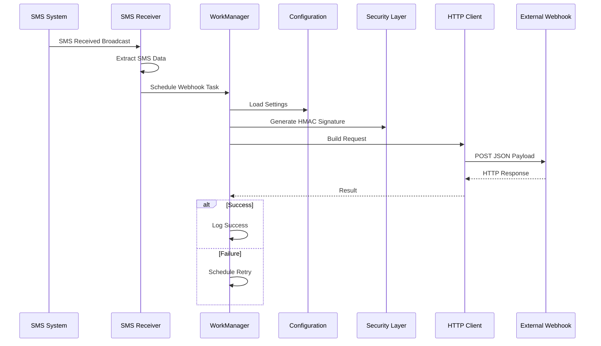

# SMS Hub Agent - 

## Document Information

- **Version**: 1.0.0
- **Last Updated**: October 13, 2025
- **Author**: Senior Android Development Team
- **Status**: Draft

## 1. System Overview

### 1.1 Purpose

SMS Hub Agent is an Android application designed to capture incoming SMS messages and forward them to external systems via secure webhook endpoints. The application operates continuously in the background without user intervention while maintaining strict security and privacy standards.

### 1.2 Scope

This specification covers:

- Architecture design and component interactions
- Material 3 UI implementation details
- Security protocols and encryption methods
- Background service management
- Error handling and retry mechanisms
- Performance requirements and constraints

### 1.3 Target Platform

- **Minimum SDK**: Android 21 (Lollipop 5.0)
- **Target SDK**: Android 34 (Android 14)
- __Architecture__: ARM64, ARM32, x86_64
- **Memory**: Minimum 2GB RAM
- **Storage**: 50MB application space

## 2. Architecture Design

### 2.1 High-Level Architecture

The application follows a modular architecture pattern with clear separation of concerns:

```ini
┌─────────────────────────────────────────────────────────────┐
│                      Presentation Layer                     │
├─────────────────────────────────────────────────────────────┤
│  MainActivity (Compose)  │  SettingsActivity (Compose)     │
├─────────────────────────────────────────────────────────────┤
│                      Business Logic Layer                   │
├─────────────────────────────────────────────────────────────┤
│  SMS Processor   │  Configuration Manager  │  Security     │
├─────────────────────────────────────────────────────────────┤
│                      Service Layer                          │
├─────────────────────────────────────────────────────────────┤
│  SMS Receiver    │  WorkManager Worker     │  HTTP Client  │
├─────────────────────────────────────────────────────────────┤
│                      Data Layer                             │
├─────────────────────────────────────────────────────────────┤
│  SharedPreferences │  DataStore           │  Local Queue   │
└─────────────────────────────────────────────────────────────┘
```

### 2.2 Component Specifications

#### 2.2.1 SMS Receiver Component

```kotlin
class SmsReceiver : BroadcastReceiver() {
    // Priority: 1000 (high priority for immediate processing)
    // Permissions: RECEIVE_SMS, BROADCAST_SMS
    // Lifecycle: System-managed broadcast receiver
    
    override fun onReceive(context: Context, intent: Intent) {
        // Extract SMS data
        // Validate sender format
        // Create SmsMessage data object
        // Schedule WorkManager task
        // Log activity for debugging
    }
}
```

#### 2.2.2 Work Manager Integration

```kotlin
class WebhookWorker(
    context: Context,
    params: WorkerParameters
) : CoroutineWorker(context, params) {
    
    // Constraints: Network connectivity required
    // Retry Policy: ExponentialBackoff (initial: 30s, max: 10min)
    // Input Data: SMS content, sender, timestamp, device info
    
    override suspend fun doWork(): Result {
        // Load configuration from DataStore
        // Build HTTP request with security headers
        // Execute webhook call with timeout
        // Handle response and errors
        // Return Result.success() or Result.retry()
    }
}
```

### 2.3 Data Flow Sequence



## 3. Material 3 UI Implementation

### 3.1 Design System Tokens

#### 3.1.1 Color System

```kotlin
// Light Theme Palette
object LightColorScheme {
    val primary = Color(0xFF6750A4)
    val onPrimary = Color(0xFFFFFFFF)
    val primaryContainer = Color(0xFFEADDFF)
    val onPrimaryContainer = Color(0xFF21005D)
    
    val secondary = Color(0xFF625B71)
    val onSecondary = Color(0xFFFFFFFF)
    val secondaryContainer = Color(0xFFE8DEF8)
    val onSecondaryContainer = Color(0xFF1D192B)
    
    val tertiary = Color(0xFF7D5260)
    val onTertiary = Color(0xFFFFFFFF)
    val tertiaryContainer = Color(0xFFFFD8E4)
    val onTertiaryContainer = Color(0xFF31111D)
    
    val error = Color(0xFFBA1A1A)
    val onError = Color(0xFFFFFFFF)
    val errorContainer = Color(0xFFFFDAD6)
    val onErrorContainer = Color(0xFF410002)
    
    val surface = Color(0xFFFEF7FF)
    val onSurface = Color(0xFF1D1B20)
    val surfaceVariant = Color(0xFFE7E0EC)
    val onSurfaceVariant = Color(0xFF49454F)
    
    val outline = Color(0xFF79747E)
    val outlineVariant = Color(0xFFCAC4D0)
}

// Dark Theme Palette
object DarkColorScheme {
    val primary = Color(0xFFD0BCFF)
    val onPrimary = Color(0xFF381E72)
    val primaryContainer = Color(0xFF4F378B)
    val onPrimaryContainer = Color(0xFFEADDFF)
    
    // ... additional dark theme colors
}
```

#### 3.1.2 Typography System

```kotlin
val AppTypography = Typography(
    displayLarge = TextStyle(
        fontFamily = FontFamily.Default,
        fontWeight = FontWeight.Normal,
        fontSize = 57.sp,
        lineHeight = 64.sp,
        letterSpacing = (-0.25).sp
    ),
    displayMedium = TextStyle(
        fontFamily = FontFamily.Default,
        fontWeight = FontWeight.Normal,
        fontSize = 45.sp,
        lineHeight = 52.sp,
        letterSpacing = 0.sp
    ),
    displaySmall = TextStyle(
        fontFamily = FontFamily.Default,
        fontWeight = FontWeight.Normal,
        fontSize = 36.sp,
        lineHeight = 44.sp,
        letterSpacing = 0.sp
    ),
    headlineLarge = TextStyle(
        fontFamily = FontFamily.Default,
        fontWeight = FontWeight.Normal,
        fontSize = 32.sp,
        lineHeight = 40.sp,
        letterSpacing = 0.sp
    ),
    headlineMedium = TextStyle(
        fontFamily = FontFamily.Default,
        fontWeight = FontWeight.Normal,
        fontSize = 28.sp,
        lineHeight = 36.sp,
        letterSpacing = 0.sp
    ),
    headlineSmall = TextStyle(
        fontFamily = FontFamily.Default,
        fontWeight = FontWeight.Normal,
        fontSize = 24.sp,
        lineHeight = 32.sp,
        letterSpacing = 0.sp
    ),
    titleLarge = TextStyle(
        fontFamily = FontFamily.Default,
        fontWeight = FontWeight.Normal,
        fontSize = 22.sp,
        lineHeight = 28.sp,
        letterSpacing = 0.sp
    ),
    titleMedium = TextStyle(
        fontFamily = FontFamily.Default,
        fontWeight = FontWeight.Medium,
        fontSize = 16.sp,
        lineHeight = 24.sp,
        letterSpacing = 0.15.sp
    ),
    titleSmall = TextStyle(
        fontFamily = FontFamily.Default,
        fontWeight = FontWeight.Medium,
        fontSize = 14.sp,
        lineHeight = 20.sp,
        letterSpacing = 0.1.sp
    ),
    bodyLarge = TextStyle(
        fontFamily = FontFamily.Default,
        fontWeight = FontWeight.Normal,
        fontSize = 16.sp,
        lineHeight = 24.sp,
        letterSpacing = 0.5.sp
    ),
    bodyMedium = TextStyle(
        fontFamily = FontFamily.Default,
        fontWeight = FontWeight.Normal,
        fontSize = 14.sp,
        lineHeight = 20.sp,
        letterSpacing = 0.25.sp
    ),
    bodySmall = TextStyle(
        fontFamily = FontFamily.Default,
        fontWeight = FontWeight.Normal,
        fontSize = 12.sp,
        lineHeight = 16.sp,
        letterSpacing = 0.4.sp
    ),
    labelLarge = TextStyle(
        fontFamily = FontFamily.Default,
        fontWeight = FontWeight.Medium,
        fontSize = 14.sp,
        lineHeight = 20.sp,
        letterSpacing = 0.1.sp
    ),
    labelMedium = TextStyle(
        fontFamily = FontFamily.Default,
        fontWeight = FontWeight.Medium,
        fontSize = 12.sp,
        lineHeight = 16.sp,
        letterSpacing = 0.5.sp
    ),
    labelSmall = TextStyle(
        fontFamily = FontFamily.Default,
        fontWeight = FontWeight.Medium,
        fontSize = 11.sp,
        lineHeight = 16.sp,
        letterSpacing = 0.5.sp
    )
)
```

#### 3.1.3 Shape System

```kotlin
val AppShapes = Shapes(
    extraSmall = RoundedCornerShape(4.dp),
    small = RoundedCornerShape(8.dp),
    medium = RoundedCornerShape(12.dp),
    large = RoundedCornerShape(16.dp),
    extraLarge = RoundedCornerShape(28.dp)
)
```

### 3.2 Component Specifications

#### 3.2.1 Configuration Form Layout

```kotlin
@Composable
fun ConfigurationScreen(
    uiState: ConfigurationUiState,
    onEvent: (ConfigurationEvent) -> Unit
) {
    LazyColumn(
        modifier = Modifier
            .fillMaxSize()
            .padding(16.dp),
        verticalArrangement = Arrangement.spacedBy(24.dp)
    ) {
        // Webhook Configuration Section
        item {
            ConfigurationSection(
                title = "Webhook Configuration",
                icon = Icons.Default.Webhook
            ) {
                OutlinedTextField(
                    value = uiState.webhookUrl,
                    onValueChange = { onEvent(ConfigurationEvent.WebhookUrlChanged(it)) },
                    label = { Text("Webhook URL") },
                    placeholder = { Text("https://api.example.com/webhook") },
                    leadingIcon = { Icon(Icons.Default.Link, null) },
                    isError = uiState.webhookUrlError != null,
                    supportingText = uiState.webhookUrlError?.let { { Text(it) } },
                    keyboardOptions = KeyboardOptions(keyboardType = KeyboardType.Uri),
                    modifier = Modifier.fillMaxWidth()
                )
            }
        }
        
        // Authentication Section
        item {
            ConfigurationSection(
                title = "Authentication",
                icon = Icons.Default.Security
            ) {
                Column(verticalArrangement = Arrangement.spacedBy(16.dp)) {
                    Row(
                        modifier = Modifier.fillMaxWidth(),
                        horizontalArrangement = Arrangement.SpaceBetween,
                        verticalAlignment = Alignment.CenterVertically
                    ) {
                        Text(
                            text = "Enable Basic Authentication",
                            style = MaterialTheme.typography.bodyLarge
                        )
                        Switch(
                            checked = uiState.enableAuth,
                            onCheckedChange = { onEvent(ConfigurationEvent.AuthEnabledChanged(it)) }
                        )
                    }
                    
                    AnimatedVisibility(visible = uiState.enableAuth) {
                        Column(verticalArrangement = Arrangement.spacedBy(16.dp)) {
                            OutlinedTextField(
                                value = uiState.username,
                                onValueChange = { onEvent(ConfigurationEvent.UsernameChanged(it)) },
                                label = { Text("Username") },
                                leadingIcon = { Icon(Icons.Default.Person, null) },
                                modifier = Modifier.fillMaxWidth()
                            )
                            
                            OutlinedTextField(
                                value = uiState.password,
                                onValueChange = { onEvent(ConfigurationEvent.PasswordChanged(it)) },
                                label = { Text("Password") },
                                leadingIcon = { Icon(Icons.Default.Lock, null) },
                                visualTransformation = PasswordVisualTransformation(),
                                keyboardOptions = KeyboardOptions(keyboardType = KeyboardType.Password),
                                modifier = Modifier.fillMaxWidth()
                            )
                        }
                    }
                }
            }
        }
        
        // Security Options Section
        item {
            ConfigurationSection(
                title = "Security Options",
                icon = Icons.Default.Shield
            ) {
                Column(verticalArrangement = Arrangement.spacedBy(16.dp)) {
                    Row(
                        modifier = Modifier.fillMaxWidth(),
                        horizontalArrangement = Arrangement.SpaceBetween,
                        verticalAlignment = Alignment.CenterVertically
                    ) {
                        Column {
                            Text(
                                text = "Enable HMAC Signing",
                                style = MaterialTheme.typography.bodyLarge
                            )
                            Text(
                                text = "Add signature verification header",
                                style = MaterialTheme.typography.bodySmall,
                                color = MaterialTheme.colorScheme.onSurfaceVariant
                            )
                        }
                        Switch(
                            checked = uiState.enableHmac,
                            onCheckedChange = { onEvent(ConfigurationEvent.HmacEnabledChanged(it)) }
                        )
                    }
                    
                    AnimatedVisibility(visible = uiState.enableHmac) {
                        OutlinedTextField(
                            value = uiState.hmacSecret,
                            onValueChange = { onEvent(ConfigurationEvent.HmacSecretChanged(it)) },
                            label = { Text("HMAC Secret") },
                            placeholder = { Text("Enter secret key") },
                            leadingIcon = { Icon(Icons.Default.Key, null) },
                            isError = uiState.hmacSecretError != null,
                            supportingText = uiState.hmacSecretError?.let { { Text(it) } },
                            modifier = Modifier.fillMaxWidth()
                        )
                    }
                }
            }
        }
        
        // Action Buttons
        item {
            Row(
                modifier = Modifier.fillMaxWidth(),
                horizontalArrangement = Arrangement.spacedBy(16.dp)
            ) {
                OutlinedButton(
                    onClick = { onEvent(ConfigurationEvent.TestConfiguration) },
                    modifier = Modifier.weight(1f),
                    enabled = uiState.isValid && !uiState.isLoading
                ) {
                    if (uiState.isTesting) {
                        CircularProgressIndicator(
                            modifier = Modifier.size(16.dp),
                            strokeWidth = 2.dp
                        )
                    } else {
                        Icon(Icons.Default.NetworkCheck, null)
                    }
                    Spacer(modifier = Modifier.width(8.dp))
                    Text("Test Connection")
                }
                
                Button(
                    onClick = { onEvent(ConfigurationEvent.SaveConfiguration) },
                    modifier = Modifier.weight(1f),
                    enabled = uiState.isValid && !uiState.isLoading
                ) {
                    if (uiState.isSaving) {
                        CircularProgressIndicator(
                            modifier = Modifier.size(16.dp),
                            strokeWidth = 2.dp,
                            color = MaterialTheme.colorScheme.onPrimary
                        )
                    } else {
                        Icon(Icons.Default.Save, null)
                    }
                    Spacer(modifier = Modifier.width(8.dp))
                    Text("Save Configuration")
                }
            }
        }
    }
}
```

## 4. Security Specifications

### 4.1 HMAC-SHA256 Implementation

```kotlin
object HMACGenerator {
    private const val HMAC_ALGORITHM = "HmacSHA256"
    private const val SIGNATURE_PREFIX = "sha256="
    
    fun generateSignature(payload: String, secret: String): String {
        return try {
            val mac = Mac.getInstance(HMAC_ALGORITHM)
            val secretKeySpec = SecretKeySpec(secret.toByteArray(Charsets.UTF_8), HMAC_ALGORITHM)
            mac.init(secretKeySpec)
            
            val signature = mac.doFinal(payload.toByteArray(Charsets.UTF_8))
            SIGNATURE_PREFIX + signature.joinToString("") { "%02x".format(it) }
        } catch (e: Exception) {
            throw SecurityException("Failed to generate HMAC signature", e)
        }
    }
    
    fun verifySignature(payload: String, secret: String, receivedSignature: String): Boolean {
        val expectedSignature = generateSignature(payload, secret)
        return MessageDigest.isEqual(
            expectedSignature.toByteArray(Charsets.UTF_8),
            receivedSignature.toByteArray(Charsets.UTF_8)
        )
    }
}
```

### 4.2 Network Security Configuration

```xml
<!-- res/xml/network_security_config.xml -->
<?xml version="1.0" encoding="utf-8"?>
<network-security-config>
    <domain-config cleartextTrafficPermitted="false">
        <domain includeSubdomains="true">api.example.com</domain>
        <pin-set expiration="2026-01-01">
            <pin digest="SHA-256">AAAAAAAAAAAAAAAAAAAAAAAAAAAAAAAAAAAAAAAAAAA=</pin>
            <pin digest="SHA-256">BBBBBBBBBBBBBBBBBBBBBBBBBBBBBBBBBBBBBBBBBBB=</pin>
        </pin-set>
    </domain-config>
</network-security-config>
```

## 5. Performance Requirements

### 5.1 Response Time Requirements

- SMS processing latency: < 500ms
- Webhook delivery: < 5 seconds (excluding network delays)
- UI response time: < 100ms for all interactions
- Background task scheduling: < 1 second

### 5.2 Resource Constraints

- Memory usage: < 50MB during normal operation
- Battery consumption: < 2% per day with moderate SMS volume
- Storage footprint: < 20MB for app and configuration data
- Network bandwidth: Minimal impact with efficient payload design

### 5.3 Reliability Metrics

- SMS capture success rate: > 99.9%
- Webhook delivery success rate: > 95% (excluding external failures)
- Application availability: > 99% uptime
- Data integrity: 100% accuracy in SMS forwarding

## 6. Error Handling and Recovery

### 6.1 Error Classification

```kotlin
sealed class SMSHubError : Exception() {
    data class NetworkError(override val message: String, val cause: Throwable?) : SMSHubError()
    data class ConfigurationError(override val message: String) : SMSHubError()
    data class SecurityError(override val message: String, val cause: Throwable?) : SMSHubError()
    data class PermissionError(override val message: String) : SMSHubError()
    data class SystemError(override val message: String, val cause: Throwable?) : SMSHubError()
}
```

### 6.2 Retry Strategy

```kotlin
class RetryStrategy {
    companion object {
        const val MAX_RETRIES = 3
        const val INITIAL_BACKOFF_MS = 1000L
        const val MAX_BACKOFF_MS = 30000L
        const val BACKOFF_MULTIPLIER = 2.0
    }
    
    fun calculateBackoffDelay(attempt: Int): Long {
        val baseDelay = INITIAL_BACKOFF_MS * (BACKOFF_MULTIPLIER.pow(attempt.toDouble())).toLong()
        return minOf(baseDelay, MAX_BACKOFF_MS)
    }
    
    fun shouldRetry(error: Throwable, attempt: Int): Boolean {
        return when {
            attempt >= MAX_RETRIES -> false
            error is UnknownHostException -> true
            error is SocketTimeoutException -> true
            error is ConnectException -> true
            error is HttpException && error.code() in 500..599 -> true
            else -> false
        }
    }
}
```

## 7. Data Storage and Privacy

### 7.1 Data Storage Strategy

- **Configuration Data**: Encrypted SharedPreferences with Android Keystore
- **Temporary Queue**: Room database with encryption at rest
- **Logs**: Circular buffer with automatic rotation (max 100 entries)
- **No SMS Storage**: Messages are processed and forwarded without persistent storage

### 7.2 Privacy Compliance

- GDPR compliance for EU users
- No personal data collection beyond SMS content for forwarding
- User consent mechanisms for data processing
- Data retention policy: Zero retention of SMS content
- Audit logging for security events

## 8. Testing Strategy

### 8.1 Unit Testing Coverage

```kotlin
// Example test structure
class WebhookWorkerTest {
    @Test
    fun `webhook delivery succeeds with valid configuration`() {
        // Arrange
        val mockConfig = createValidConfiguration()
        val mockSmsMessage = createTestSmsMessage()
        
        // Act
        val result = webhookWorker.processMessage(mockSmsMessage, mockConfig)
        
        // Assert
        assertTrue(result.isSuccess)
        verify(mockHttpClient).post(any(), any())
    }
    
    @Test
    fun `webhook delivery retries on network failure`() {
        // Test retry mechanism
    }
    
    @Test
    fun `HMAC signature is correctly generated`() {
        // Test security implementation
    }
}
```

### 8.2 Integration Testing

- End-to-end SMS flow testing
- Webhook endpoint integration
- Battery optimization behavior
- Permission flow validation

## 9. Deployment and Distribution

### 9.1 Build Configuration

```kotlin
// app/build.gradle.kts
android {
    compileSdk 34
    
    defaultConfig {
        applicationId "com.smshub.agent"
        minSdk 21
        targetSdk 34
        versionCode 1
        versionName "1.0.0"
        
        testInstrumentationRunner "androidx.test.runner.AndroidJUnitRunner"
    }
    
    buildTypes {
        release {
            isMinifyEnabled = true
            proguardFiles(getDefaultProguardFile("proguard-android-optimize.txt"), "proguard-rules.pro")
            signingConfig = signingConfigs.getByName("release")
        }
        debug {
            isDebuggable = true
            applicationIdSuffix = ".debug"
        }
    }
    
    compileOptions {
        sourceCompatibility = JavaVersion.VERSION_1_8
        targetCompatibility = JavaVersion.VERSION_1_8
    }
    
    kotlinOptions {
        jvmTarget = "1.8"
    }
}
```

### 9.2 Release Checklist

- [ ] Code review completed
- [ ] Unit tests passing (>90% coverage)
- [ ] Integration tests passing
- [ ] Security audit completed
- [ ] Performance testing validated
- [ ] Documentation updated
- [ ] Privacy policy reviewed
- [ ] Accessibility testing completed
- [ ] Multi-device testing completed
- [ ] Beta testing feedback addressed

## 10. Monitoring and Analytics

### 10.1 Application Metrics

- SMS processing success rate
- Webhook delivery latency
- Error rates by category
- Battery usage statistics
- Memory consumption patterns

### 10.2 Crash Reporting

```kotlin
// Firebase Crashlytics integration
class CrashReportingManager {
    fun logNonFatalError(error: Throwable, context: String) {
        FirebaseCrashlytics.getInstance().apply {
            setCustomKey("context", context)
            setCustomKey("app_version", BuildConfig.VERSION_NAME)
            recordException(error)
        }
    }
    
    fun setUserContext(deviceId: String) {
        FirebaseCrashlytics.getInstance().setUserId(deviceId.hashCode().toString())
    }
}
```

## 11. Maintenance and Updates

### 11.1 Update Strategy

- Automatic background updates via Google Play
- Backward compatibility for configuration data
- Migration scripts for database schema changes
- Rollback capability for critical issues

### 11.2 Support and Documentation

- In-app help system
- Troubleshooting guides
- API documentation for webhook implementers
- FAQ for common configuration issues

---

**Document Status**: This technical specification is a living document and will be updated as the application evolves. All changes should be reviewed and approved by the technical lead before implementation.